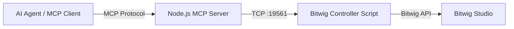

# Bitwig MCP POC

**A Proof of Concept bridging [Bitwig Studio](https://www.bitwig.com/) with the [Model Context Protocol (MCP)](https://modelcontextprotocol.io/).**

## 🎯 Goal
The goal of this project is to demonstrate how an AI Agent can control a Digital Audio Workstation (DAW) like Bitwig Studio. By exposing Bitwig's API through an MCP Server, Large Language Models (LLMs) can directly interact with the music production environment to perform tasks like:
- Creating tracks
- Controlling transport (Play, Stop, Restart)
- *(Future)* Modifying devices, arranging clips, and mixing.

## 🏗 Architecture
The project consists of two main components communicating over a local TCP socket:

1.  **MCP Server (`index.js`)**
    - A Node.js application that implements the Model Context Protocol.
    - It listens for instructions from an MCP Client (like an AI Assistant).
    - It acts as a TCP Server on port `19561` to relay commands to Bitwig.

2.  **Bitwig Controller Script (`BitwigPOC.control.js`)**
    - A Java/JavaScript extension running inside Bitwig Studio.
    - It connects to the MCP Server via TCP.
    - It executes the API commands (e.g., `application.createInstrumentTrack()`) received from the server.



## ✨ Features / Tools
The following MCP tools are currently implemented:
- **`bitwig_add_track`**: Adds a new instrument track to the project.
- **`bitwig_play`**: Starts playback.
- **`bitwig_stop`**: Stops playback.
- **`bitwig_restart`**: Restarts playback from the beginning.

## 🚀 Installation

### 1. Prerequisites
- [Node.js](https://nodejs.org/) (v16 or higher)
- [Bitwig Studio](https://www.bitwig.com/) installed

### 2. Install Dependencies
Clone this repository and install the Node.js dependencies:
```bash
npm install
```

### 3. Install Bitwig Controller Script
You need to install the controller script so Bitwig can load it.

**Option A: Symbol Link (Recommended for development)**
Symlink the `bitwig-controller/BitwigPOC` folder into your Bitwig Controller Scripts directory.
*Likely location on Linux/Mac:* `~/Documents/Bitwig Studio/Controller Scripts/`
*Likely location on Windows:* `%USERPROFILE%\Documents\Bitwig Studio\Controller Scripts\`

```bash
# Example for Linux/Mac
ln -s "$(pwd)/bitwig-controller/BitwigPOC" "$HOME/Documents/Bitwig Studio/Controller Scripts/"
```

**Option B: Manual Copy**
Copy the `bitwig-controller/BitwigPOC` folder into your Bitwig Controller Scripts directory.

### 4. Enable in Bitwig
1. Open Bitwig Studio.
2. Go to **Settings** > **Controllers**.
3. Choose **Add controller manually**.
4. Select **Bitwig POC** > **Bitwig POC**.
5. The script should load and attempt to connect to the server (it will retry if the server isn't running).

## 💻 Usage

### 1. Start the MCP Server
Run the Node.js server. It will start listening on the standard input/output for MCP and on TCP port 19561 for Bitwig.

```bash
node index.js
```

### 2. Connect your AI Agent
Configure your MCP Client (e.g., Claude Desktop, Zed, or other MCP-compliant tools) to run the command above.

### 3. Example Prompts
Once connected, you can ask your AI Agent:
> "Add a new instrument track in Bitwig."
> "Start playback."
> "Stop the music."
