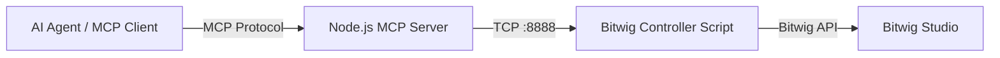

# Bitwig MCP POC

**A Proof of Concept bridging [Bitwig Studio](https://www.bitwig.com/) with the [Model Context Protocol (MCP)](https://modelcontextprotocol.io/).**

## 🎯 Goal

The goal of this project is to demonstrate how an AI Agent can control a Digital Audio Workstation (DAW) like Bitwig Studio. By exposing Bitwig's API through an MCP Server, Large Language Models (LLMs) can directly interact with the music production environment to perform tasks like:

- Creating tracks
- Controlling transport (Play, Stop, Restart)
- Managing devices, arranging clips, and mixing.

## 🏗 Architecture

The project consists of two main components communicating over a local TCP socket:

1. **MCP Server (`server-mcp-java/`, built via Gradle)**
   
   - A Java application that implements the Model Context Protocol using the official `io.modelcontextprotocol.sdk`.
   - It listens for instructions from an MCP Client (like an AI Assistant) over Standard I/O.
   - It acts as a TCP client and connects to Bitwig on port `8888` to relay commands.
   - *(Note: The legacy TypeScript server remains in `server-mcp/` during the transition period).*

2. **Bitwig Controller Script (`bitwig-controller/controller-mcp.ts`, bundled to `bitwig-controller/controller-mcp.js`)**
   
   - A Java/JavaScript extension running inside Bitwig Studio.
   - It connects to the MCP Server via TCP.
   - It executes the API commands (e.g., `application.createInstrumentTrack()`) received from the server.


```mermaid
graph LR
    A[AI Agent / MCP Client] -->|MCP Protocol| B[Node.js MCP Server]
    B -->|TCP :8888| C[Bitwig Controller Script]
    C -->|Bitwig API| D[Bitwig Studio]
```

## ✨ Features / Tools

The following MCP capabilities are currently implemented:

### 🗄 Resources (Read State)

- `bitwig://project/summary`: JSON overview of project state (transport, selection, etc.)
- `bitwig://tracks`: List of all tracks
- `bitwig://scenes`: List of all scenes
- `bitwig://devices`: List of devices on the currently selected track

### 💬 Prompts (Templates)

- `explain_project`: Fetches project structure and asks the AI to explain it.
- `analyze_track`: Fetches the selected track's status and devices for analysis.

### 🛠 Tools (Actions)

### Transport

- `transport_play`: Start playback
- `transport_stop`: Stop playback
- `transport_restart`: Restart playback
- `transport_record`: Toggle recording
- `transport_get_tempo` / `transport_set_tempo`: Manage BPM
- `transport_get_position` / `transport_set_position`: Manage playhead position
- `transport_playing_status`: Check if transport is playing
- `transport_toggle_loop`: Toggle loop on/off
- `transport_set_loop_start` / `transport_set_loop_end`: Set loop region
- `transport_get_loop_status`: Query loop state (enabled, start, end)
- `transport_tap_tempo`: Tap to match BPM via rhythmic input
- `transport_get_punch_status` / `transport_set_punch_in` / `transport_set_punch_out`: Read and control punch-in/out recording gates
- `transport_toggle_punch_in` / `transport_toggle_punch_out`: Flip the punch gate state
- `transport_get_overdub_status` / `transport_toggle_arranger_overdub` / `transport_toggle_launcher_overdub`: Inspect and toggle arranger/launcher overdub modes
- `transport_continue_playback`, `transport_return_to_zero`, `transport_fast_forward`, `transport_rewind`, `transport_nudge_forward`, `transport_nudge_backward`: Navigate the timeline without restarting playback

### Track & Mixer

- `track_bank_get_status`: Get info (name/vol/pan/mute/solo) for 8 tracks
- `track_bank_set_volume`, `_pan`, `_mute`, `_solo`: Control tracks by bank index
- `track_bank_select`: Select a track in the bank
- `track_delete`: Delete a track
- `track_rename`: Rename a track
- `track_duplicate`: Duplicate a track
- `track_set_color`: Set track color (RGB)
- `track_selected_get_status`: Get info for the currently selected track
- `track_selected_set_volume`, `_pan`, `_mute`, `_solo`, `_arm`: Control the selected track
- `track_list`: Enumerate the current bank of 8 tracks with metadata (name, type, position, group flag, color)
- `track_get_info`: Get deep metadata and state (volume/pan/mute/solo/arm) for a single track index
- `track_scroll_into_view`: Make a specific track visible in the arranger and mixer
- `track_bank_scroll_forward` / `_backward` / `_to_position`: Scroll the bank through the overall track list

### Cursor & Selection

- `cursor_track_get_status`: Read the selected track's metadata, transport state, color, and mix settings
- `cursor_device_get_status`: Inspect the currently selected device (expanded, enabled, window state)
- `cursor_clip_get_status`: Inspect the currently selected clip (loop positions, play region, color)

### Testing

- Phase 1 is covered by new automated tests:
  - `tests/test_phase1.ts` exercises the combined transport, browser, and track tools delivered so far.
  - `tests/test_transport.ts` now validates tap tempo, punch/overdub controls, and navigation tools.
  - `tests/test_browser.ts` now asserts the updated `browser_set_filter` behavior.

## 🚀 Installation

### 1. Prerequisites

- [Node.js](https://nodejs.org/) (v16 or higher)
- [Bitwig Studio](https://www.bitwig.com/) installed

### 2. Install Dependencies

Clone this repository and install the dependencies:

**For the Bitwig Controller (Node):**

```bash
npm install
```

**For the MCP Server (Java):**

```bash
cd server-mcp-java
./gradlew build
```

### 3. Install Bitwig Controller Script

You need to install the controller script so Bitwig can load it.

**Option A: Symbol Link (Recommended for development)**
Create a controller script folder in your Bitwig Controller Scripts directory (for example `BitwigPOC`) and place `controller-mcp.js` in that folder.
*Likely location on Linux/Mac:* `~/Documents/Bitwig Studio/Controller Scripts/`
*Likely location on Windows:* `%USERPROFILE%\Documents\Bitwig Studio\Controller Scripts\`

```bash
# Example for Linux/Mac
mkdir -p "$HOME/Documents/Bitwig Studio/Controller Scripts/BitwigPOC"
cp "$(pwd)/bitwig-controller/controller-mcp.js" "$HOME/Documents/Bitwig Studio/Controller Scripts/BitwigPOC/controller-mcp.js"
```

**Option B: Manual Copy**
Copy `bitwig-controller/controller-mcp.js` into a controller folder under your Bitwig Controller Scripts directory.

### 4. Enable in Bitwig

1. Open Bitwig Studio.
2. Go to **Settings** > **Controllers**.
3. Choose **Add controller manually**.
4. Select **Bitwig POC** > **Bitwig POC**.
5. The script should load and attempt to connect to the server (it will retry if the server isn't running).

## 💻 Usage

### 1. Start the MCP Server

Run the Java server using Gradle. It listens on standard input/output for MCP, and connects to Bitwig via TCP on port `8888`.

```bash
cd server-mcp-java
./gradlew run
```

*(Alternatively, to run the legacy Node server: `node server-mcp/dist/index.js`)*

### Controller Build (Bitwig)

Any change in `bitwig-controller/**/*.ts` needs rebuilding so Bitwig can load the single bundled script at `bitwig-controller/controller-mcp.js`:

```bash
pnpm run build:controller
```

Running this command compiles `bitwig-controller/controller-mcp.ts` into one IIFE bundle with all modules inlined and overwrites `bitwig-controller/controller-mcp.js`, which is the file you drop into Bitwig's Controller Scripts directory.

### 2. Connect your AI Agent

Configure your MCP Client (e.g., Claude Desktop, Zed, or other MCP-compliant tools) to run the command above.

### 3. Example Prompts

Once connected, you can ask your AI Agent:

> "Add a new instrument track in Bitwig."
> "Start playback."
> "Stop the music."

## 🧪 LLM Test Environment

For testing the MCP server with an actual LLM agent flow (simulated via CLI), use the dedicated test environment.

### Quick Start

```bash
./tests/test-env/run-llm-test.sh
```

See the [Test Environment Documentation](tests/test-env/README.md) for more details and example prompts.
