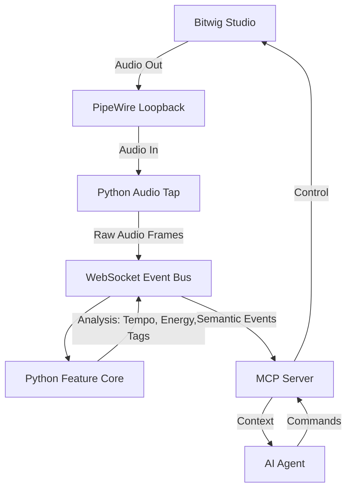

# Beat Twin - Technical Specification

## 1. Executive Summary

Beat Twin is an agentic AI system capable of listening to, analyzing, and participating in music production within a Digital Audio Workstation (DAW), specifically Bitwig Studio. It bridges the gap between Large Language Models (LLMs) and real-time audio environments, enabling a "Co-Pilot" experience for music producers.

## 2. System Architecture

The system follows a microservice architecture to decouple the real-time audio processing from the high-level cognitive reasoning of the LLM.

### 2.1 Core Components

1.  **Bitwig Controller (MCP Server)**:
    *   **Role**: Direct interface with Bitwig Studio via the Controller API.
    *   **Technology**: TypeScript, Java (Bitwig API), MCP (Model Context Protocol).
    *   **Functions**: Transport control, track management, device manipulation, clip launching.

2.  **The "Ear" (Audio Analysis Engine)**:
    *   **Role**: Real-time listening and feature extraction.
    *   **Technology**: Python, `sounddevice`, `librosa`, `numpy`.
    *   **Data Flow**:
        *   Audio Input (System Loopback/PipeWire) -> `Audio Tap` Service
        *   `Audio Tap` -> WebSocket Bus -> `Feature Core`
        *   `Feature Core` -> Feature Extraction (Spectral/Rhythmic) -> Semantic Tags

3.  **The "Brain" (LLM Agent)**:
    *   **Role**: Cognitive processing, decision making, and user interaction.
    *   **Technology**: Gemeni/Claude/GPT via MCP.
    *   **Capabilities**:
        *   Receives semantic tags ("dark", "fast", "rhythmic").
        *   Queries Bitwig state.
        *   Executes complex workflows (e.g., "Create a dark techno bassline").

### 2.2 Data Flow Pipeline

## 3. Audio Analysis & Tagging

The `Feature Core` service is responsible for translating raw audio into semantic descriptors.

### 3.1 Feature Extraction
We utilize `librosa` for real-time (buffered) feature extraction:
*   **Spectral Centroid**: Measures "brightness".
*   **Spectral Rolloff**: Distinguishes noise/percussive elements.
*   **Zero Crossing Rate (ZCR)**: Detects noisiness/texture.
*   **Onset Strength**: Detects rhythmic transients.

### 3.2 Semantic Tagging logic
The system maps numerical features to human-readable tags:

| Tag | Condition |
| :--- | :--- |
| **Dark** | Low Spectral Centroid (< 1500Hz) |
| **Bright** | High Spectral Centroid (> 3000Hz) |
| **Rhythmic** | High Beat Strength / Pulse Clarity |
| **Ambient** | Low Beat Strength, consistent energy |
| **Noisy/FX** | High Zero Crossing Rate |

## 4. Implementation Details

### 4.1 Python Services
*   **`audio_tap`**: Uses `sounddevice` with a callback to push raw audio frames to the WebSocket.
*   **`feature_core`**: Accumulates frames into a buffer (e.g., 2 seconds), runs `librosa` analysis, and emits `feature_event` JSON objects.

### 4.2 Inter-Process Communication
*   **WebSocket**: Chosen for low-latency, full-duplex communication between Python services and the MCP server/Frontend.
*   **JSON Schema**: Strict contracts define the structure of `audio_frame` and `feature_event` to ensure reliability.

## 5. Future Roadmap

1.  **Audio Fingerprinting**: Recognize specific loops or samples.
2.  **Stem Separation**: Isolate drums/bass for focused analysis.
3.  **Voice Interaction**: Vocal commands to control the DAW.
4.  **Generative Audio**: The agent sends audio/midi *back* to Bitwig.
