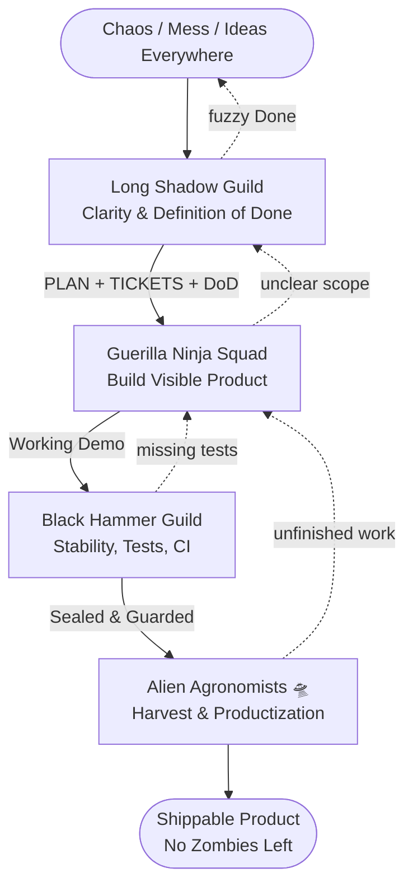

# ORCHESTRATION

```mermaid
flowchart TD
    CHAOS([Chaos / Mess / Ideas Everywhere])

    CHAOS --> LS[Long Shadow Guild<br/>Clarity & Definition of Done]

    LS -->|PLAN + TICKETS + DoD| GN[Guerilla Ninja Squad<br/>Build Visible Product]

    GN -->|Working Demo| BH[Black Hammer Guild<br/>Stability, Tests, CI]

    BH -->|Sealed & Guarded| AA[Alien Agronomists 🛸<br/>Harvest & Productization]

    AA --> PRODUCT([Shippable Product<br/>No Zombies Left])

    %% Failure loops
    GN -. unclear scope .-> LS
    BH -. missing tests .-> GN
    AA -. unfinished work .-> GN

    %% Sacred law
    LS -. fuzzy Done .-> CHAOS
```
